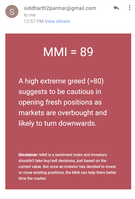

# MMI Alert
Send email alerts whenever mmi crosses a threshold value. This is a scheduled cron (runs Mon-Fri at 11am IST) job built using [AWS Lamda](https://aws.amazon.com/lambda/), [Serverless](https://serverless.com/) and [Node](https://nodejs.org/en/)

  
  

### What is MMI?
MMI stands for market mood index. It's an investor sentiment tool that describes the current mood of the market. [Detailed info](https://medium.com/making-smalltalk/3-month-market-prediction-with-mmi-c497dd9d4739)

### From where are you getting this data?
I'm currently using an api created by [Smallcase](https://www.smallcase.com/). They were kind enough to make it [public](https://mmi.smallcase.com) :)

### Who can use it?
Anyone! Just follow these steps to setup your own cron job:
- Fork this repository
- Create an AWS account
- [Setup Severless on your machine](https://serverless.com/framework/docs/providers/aws/guide/quick-start/)
- [Generate email credentials for mailer library](https://www.npmjs.com/package/gmail-send#preparational-step-this-step-is-required-only-if-you-are-using-two-step-verrification)
- Save those credentials in json format in the root directory
- Install all the dependencies
- Annnd deploy your serverless app on AWS 🎉🎉

### How are these alerts useful?
These might be useful to you if you're a [passive investor](https://www.investopedia.com/terms/p/passiveinvesting.asp). MMI is a good overall indicator of market mood, which can be used to plan your investments.

 

## Disclaimer
MMI is a sentiment index and investors shouldn’t take buy/sell decisions, just based on the current value. But once an investor has decided to invest or close existing positions, the MMI can help them better time the market.
